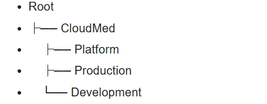
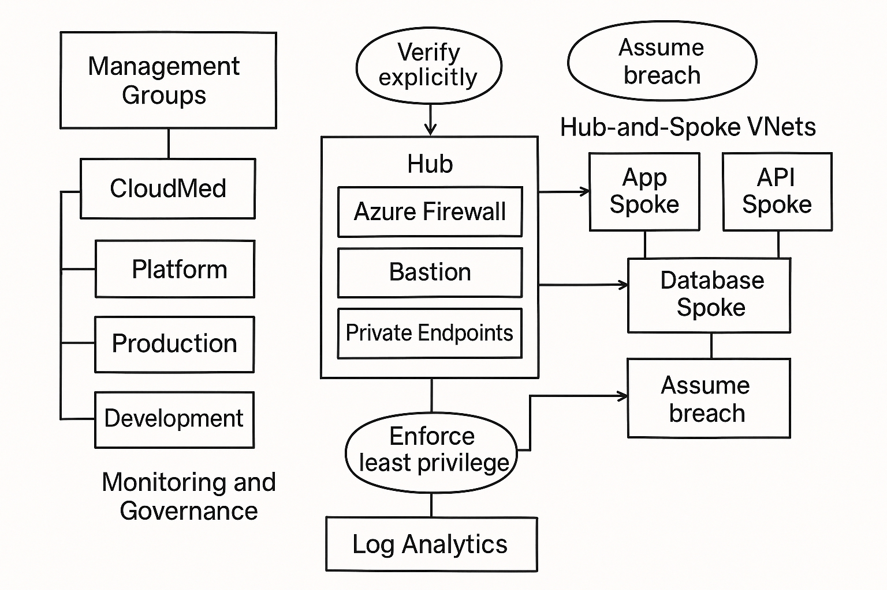

## 1. Company Overview

CloudMed Solutions is a medical technology firm which provides telemedicine solutions, electronic medical records (EMR), and AI based analytics. It runs in Europe, the United States, and Canada, and its cloud workloads are deployed in Canada Central and West Europe to provide the ability to have a performance and data-residency needs in those regions.

As CloudMed is a sensitive patient data company, it will require adopting a Zero Trust architecture in Azure to verify every access request, mitigate access, and isolate the workloads. This will contribute towards protecting the remote users, medical applications and patient information against unauthorized access.

CloudMed will also be required to comply with the major healthcare and privacy policies and regulations, such as the HIPAA, GDPR, and PIPEDA, which imply effective identity management, encryption, and safe data handling. Zero Trust landing zone in Azure meets these needs and offers a secure and scalable platform of the operations of the company on a global scale.

## 2. Governance and Identity

A well-defined structure of governance and identity is required to ensure that CloudMed maintains its Azure environment as secure, organized, and compliant with all requirements in various regions. The hierarchy of management groups that follows assists in segregating shared services, production workloads and development environments and imposing identical policies within the organization.

- **Root**  
  Top-level container where global policies and security controls are inherited.

- **CloudMed**  
  Parent group for all business environments, allowing company-wide governance to be applied consistently.

- **Platform**  
  Contains shared services such as networking, identity, monitoring, and security tools used across the organization.

- **Production**  
  Holds all customer-facing and mission-critical workloads for telemedicine, EMR, and analytics applications.

- **Development**  
  Supports testing, staging, and non-production workloads used by developers and analysts.

## Governance Model

### Role-Based Access Control (RBAC) 

CloudMed assigns access based on the principle of least privilege:

- **Admins**  
  Elevated access to manage the entire environment, but restricted through Just-in-Time (JIT) controls.

- **DevOps Team**  
  Contributor access to the Development and Production subscriptions for deployments and automation tasks.

- **Finance Team**  
  Reader or Cost Management Reader access to view budgets, spending, and cost reports without operational permissions.

This structure ensures each group only receives the access required for their responsibilities.

### **Azure Policies**
Azure Policy is used to enforce consistent security and compliance across CloudMed’s environment. Key policy examples include:

- **Allowed Regions**  
  Restrict deployments to Canada Central and West Europe to meet data residency requirements.

- **Mandatory Tags**  
  Require tags such as Environment, Department, and DataSensitivity for cost tracking and compliance.

- **Resource Consistency**  
  Enforce encryption at rest, deny public IP creation, and require private endpoints for databases and storage.

These policies help CloudMed maintain regulatory compliance (HIPAA, GDPR, PIPEDA) and reduce misconfigurations.

### **Identity Security with Azure Entra ID**
Azure Entra ID serves as CloudMed’s central identity provider. Identity is secured through:

- **Multi-Factor Authentication (MFA)**  
  Required for all employees, especially administrators and remote users.

- **Conditional Access Policies**  
  Evaluate user risk, device compliance, and login location before granting access.

- **Privileged Identity Management (PIM)**  
  Provides Just-in-Time (JIT) permissions for admin roles, reducing the attack surface.

This approach aligns with Zero Trust principles by verifying every identity and enforcing strict control over privileged access.

 
## 3. Network Architecture

The Azure network at CloudMed is based on the Hub-and-Spoke architecture in order to facilitate a high level of security, workload isolation, and Zero Trust principles. This design is used to centralize all the core services and security controls in the hub, and separate the application workloads into spokes. The model minimizes the risk of lateral movement, provides segmentation and secures sensitive healthcare data.

- **Hub-and-Spoke Design and Zero Trust Alignment -**
  The hub serves as the key structure of security and connectivity. Communication between the workloads is not allowed as all traffic flows inside controlled monitored paths. This helps to enforce Zero Trust through checking traffic flows and granting least-privilege access to the network and blocking unrestricted communication between applications unless permitted.

The spokes are home to various levels of CloudMed workloads namely Application, API, and Database. Every spoke has virtual network and subnet boundaries so that there is high segmentation and minimizing any blast radius of any potential breach.

### **Hub Components**
The hub contains shared security and management services used across all environments:

- **Azure Firewall**  
  Filters and inspects all inbound, outbound, and inter-spoke traffic.

- **Azure Bastion**  
  Provides secure VM access without exposing public IPs.

- **Private DNS Zones**  
  Supports name resolution for private endpoints.

- **Log Analytics Workspace**  
  Central collection point for monitoring, logging, and security insights.

These services enforce Zero Trust principles by verifying traffic and restricting access paths.

### **Workload Isolation in Spokes (App, API, DB)**

Each workload runs in its own spoke VNet, separated by purpose and sensitivity:

- **App Spoke**  
  Hosts web front-end services and telemedicine application components.

- **API Spoke**  
  Contains backend services, authentication logic, and business APIs that communicate with both the App and DB tiers.

- **Database Spoke**  
  Hosts Azure SQL and storage services, protected by private endpoints and restricted access policies.

Inside each spoke, resources are placed into dedicated subnets (e.g., web, app, management) to improve security and enforce NSG rules. This segmentation prevents workloads from directly communicating unless explicitly allowed through firewall rules.

---

### **Traffic Control and Isolation**

- **East–West traffic**  
  (App → API → DB) flows through the **Azure Firewall**, ensuring inspection and monitoring.

- **Private Endpoints**  
  Used for SQL and storage, keeping all data traffic off the public internet.

- **Subnet Separation**  
  Within each spoke, subnets and NSGs limit access to only required ports and services.

This architecture minimizes lateral movement, protects sensitive medical data, and supports Zero Trust security for CloudMed’s cloud environment.

## 4. Zero Trust Controls

CloudMed’s design applies the three core Zero Trust principles to protect sensitive healthcare data and limit unauthorized access across its Azure environment.

### **Verify Explicitly**
Access to all resources is authenticated and validated using strong identity controls.  
Azure Entra ID provides centralized authentication, while **Multi-Factor Authentication (MFA)** and **Conditional Access policies** ensure users are verified based on risk, device compliance, and sign-in location.

### **Least Privilege Access**
Role-Based Access Control (RBAC) assigns only the permissions required for each role.  
Administrators receive elevated access through **Privileged Identity Management (PIM)** with **Just-in-Time (JIT)** approvals.  
Application identities use managed identities with minimal required permissions.

### **Assume Breach**
Network segmentation is enforced using the hub-and-spoke model, subnet boundaries, and NSGs to limit lateral movement.  
Sensitive services, such as Azure SQL and storage, use **Private Endpoints**, ensuring data never travels over the public internet.  
All activity is captured through **Azure Monitor** and **Defender for Cloud**, enabling quick detection and response to threats.

---

### **Specific Design Examples**
- **Azure Bastion** for secure admin access with no public RDP/SSH.
- **Private Link** for Azure SQL and Storage to restrict data access to private networks.
- **Policy to block public IPs** on production resources.
- **Subnet separation** to isolate App, API, and Database tiers.
- **Firewall-controlled east–west traffic** between spokes.

### 5. Monitoring, Compliance, and Cost 

CloudMed uses Azure’s built-in monitoring and governance tools to maintain visibility, meet regulatory expectations, and control operational costs across its cloud environment.

### **Monitoring**
All logs and metrics from firewalls, virtual machines, databases, and applications are centralized in a **Log Analytics Workspace**.  
This allows CloudMed to create dashboards, run queries, and detect anomalies across all regions.

**Defender for Cloud** provides continuous security assessments, recommends fixes, and alerts administrators about insecure configurations or suspicious activity. 

Together, these tools provide end-to-end monitoring across identity, network, and application layers.

---

### **Compliance Enforcement**
CloudMed enforces regulatory and internal standards using **Azure Policy**.  
Policies ensure that only approved regions are used, sensitive resources are encrypted, required tags are applied, and public IPs are blocked on production workloads.

Compliance results are visible through Azure Policy’s **compliance dashboard**, which identifies non-compliant resources and helps CloudMed remain aligned with **HIPAA, GDPR, and PIPEDA**.

---

### **Cost Management**
To manage cloud spending, CloudMed uses **Azure Cost Management + Budgets** to set monthly or departmental spending limits.  
**Alerts** notify teams if usage approaches or exceeds thresholds.

Required resource **tags** such as Environment, Department, and CostCenter help track and allocate costs across projects and business units.  
These practices ensure predictable spending and financial accountability as CloudMed scales globally.

## 6. Conceptual Diagram

## 7. Summary and Recommendations

The suggested landing zone architecture offers CloudMed with a secure, compliant, and scalable base to run healthcare workloads in the Azure. The environment enables the implementation of Zero Trust principles in the identity, network access, and data protection spheres with the help of a strong identity control, a hierarchy of management groups, and a hub-and-spoke network model. 

Log Analytics and Defender for Cloud will provide the necessary centralized monitoring to ensure constant visibility and prompt identification of security concerns, and Azure Policy will allow CloudMed to remain compliant with HIPAA, GDPR, and PIPEDA. The exposure is also minimized by using private endpoints, segmentation, and the least-privilege access that constrain the effects of possible breaches. In sum, the architecture offers a stable and scalable architecture capable of expanding with the international user base of CloudMed.

### Recommendations for Future Improvement

1. Automate Landing Zone Deployment

The use of Infrastructure as Code (AzBicep, ARM templates, or Terraform) can be deployed by CloudMed to automate the creation of management groups, policies, networking, and monitoring. This minimizes the manual labor, guarantees uniformity between settings and accelerates subsequent expansions.

2. Implement Advanced Cost Optimization Strategies

CloudMed will be able to increase cost efficiency as workloads increase through policies like autoscaling and Azure Reservations as well as frequent rightsizing of compute resources. It will be useful to add automated cost alerts and monthly optimization reviews to make the cloud spending easy to predict and efficient.  

