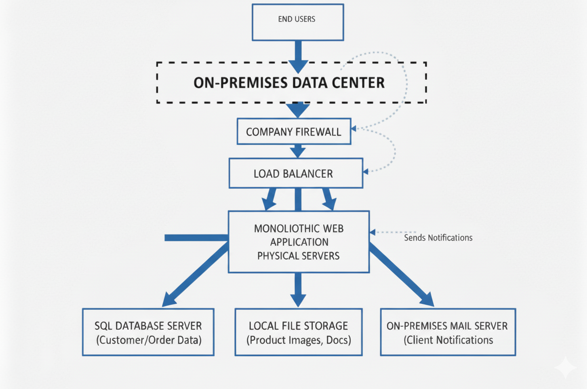

# Section 1: On-Premises Solution Design 

### Diagram

## Description of Each Component
- End Users: Customers who use the web application of the company with browsers or mobile phones.

- Company Firewall: Protects internal systems through filtering of incoming/outgoing network traffic.

- Load Balancer: Distributes incoming requests across multiple web servers to ensure performance and availability. 

- Monolithic Web Application (Physical Servers):Basic retail application that is hosted on physical, in-house servers. It handles business logic, order processing, and user interactions.

- SQL Database Server: Stores structured data like customer details, orders, and transactions.

- Local File Storage: Used for unstructured data like product images, reports, and documents. 

- On-Premises Mail Server: Use email services internally, Sends client notifications like order updates, Ensures communication with customers.

# Section 2: Cloud Migration Strategy 

## 1. Web Application (Monolithic): 

- Move To : PaaS (e.g.Azure App Service, Google App Engine) 

- Strategy: Replatform (small changes, then move). 

 - Why:
      - PaaS handles scaling, patching, and updates automatically.
      - Less management as compared to IaaS.

## 2. Database (SQL Server) 

 - Move To : PaaS (e.g. Managed SQL Database)
 - Strategy : Replatform ( change connection string, minimal adjustments)

 - Why : 

      - PaaS databases provide immediate operational benefits (automated backups, high availability, patching) with minimal changes required to the application's SQL connection string. 

## 3. File Storage:

- Move To: PaaS (e.g., AWS S3, Azure Blob Storage).
 - Strategy: Replatform.

 - Why:

    - Cloud storage is cheap, secure, and unlimited.

    - Easily integrates with the web application.

    - Removes hardware cost of on-prem file servers.

## 4. Networking & Security (Routers, Firewalls):
 
 - Move To : cloud-native services (e.g. Azure VNets)
 
 - Strategy: Replace with cloud-native services

 - Why:

    - Cloud providers offer built-in security and networking tools.

   - Easier to configure and monitor compared to physical devices.

## 5. Email Service (Client Notifications) : 
  
  - Move To: SaaS (e.g., Microsoft 365,Google Workspace)
  - Strategy: Replace 

 - Why:

     - SaaS email is secure, reliable, and globally accessible.

     - Removes cost and complexity of maintaining mail servers.

     - Includes spam filtering and compliance.