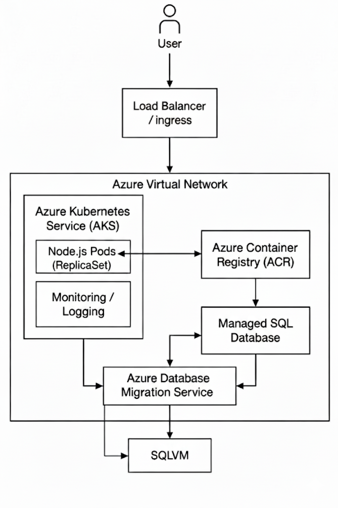

## Diagram:

## Description of the target architecture:

 - The target architecture is built on Azure Kubernetes Service (AKS), where the web application is deployed as containerized Node.js pods managed by a ReplicaSet. This ensures high availability, as Kubernetes automatically keeps the required number of pod instances running — if any pod fails, it is immediately recreated. The system is fronted by an Ingress / Load Balancer, which distributes incoming traffic from users and provides a single entry point to the application.

 - Images are securely and centrally handled by pulling the application containers out of Azure Container Registry (ACR). In the case of database services, the existent SQL database is shifted via the Azure Database Migration Service, which moves the information in the previous SQL VM to a Managed SQL Database, which is more dependable and consumes less maintenance load.

 - Every single component is hosted in a secure Azure Virtual Network, and the services communicate privately. Observability and operational stability AKS also support monitoring and logging within the cluster.

 - Overall, container orchestration via Kubernetes provides automatic scaling, self-healing, and load distribution, making the architecture both scalable and resilient.

 ## Migration Plan

 ### 1. Containerization of the Web Application

  - The Node.js application currently hosted on WebServerVM will be extracted and containerized using Docker. A Dockerfile will be created to define the runtime environment, install dependencies, and expose the required port. Once the image is built, it will be pushed to Azure Container Registry (ACR) for secure storage and version control. 
  
   - The application will then be deployed to Azure Kubernetes Service (AKS) using a Deployment with multiple replicas, ensuring high availability from day one.

### 2. Migration of the Database to Managed SQL Service

 - The current SQL server database that is on SQLVM is going to be migrated to Azure SQL Managed Database. To reduce the downtime, the initial replication and final cutover of Azure Database Migration Service (DMS) will be performed within the time limit of 6 hours. Once the migration is completed, AKS will be changed to the new connection string in its application configuration, allowing a smooth transition without interrupting the services.

### 3. Kubernetes High Availability Configuration

 - In order to reach high availability, the AKS setup will deploy several copies of the Node.js pods, which will be automatically handled by a ReplicaSet. In front of the cluster, there will be an Ingress or Load Balancer that will evenly distribute the user traffic among pods. 
 
 - Also, Horizontal Pod Autoscaling is possible, which is required to automatically expand pods as resource consumption increases, and monitoring and logging will be applied to track the overall system health and performance.
